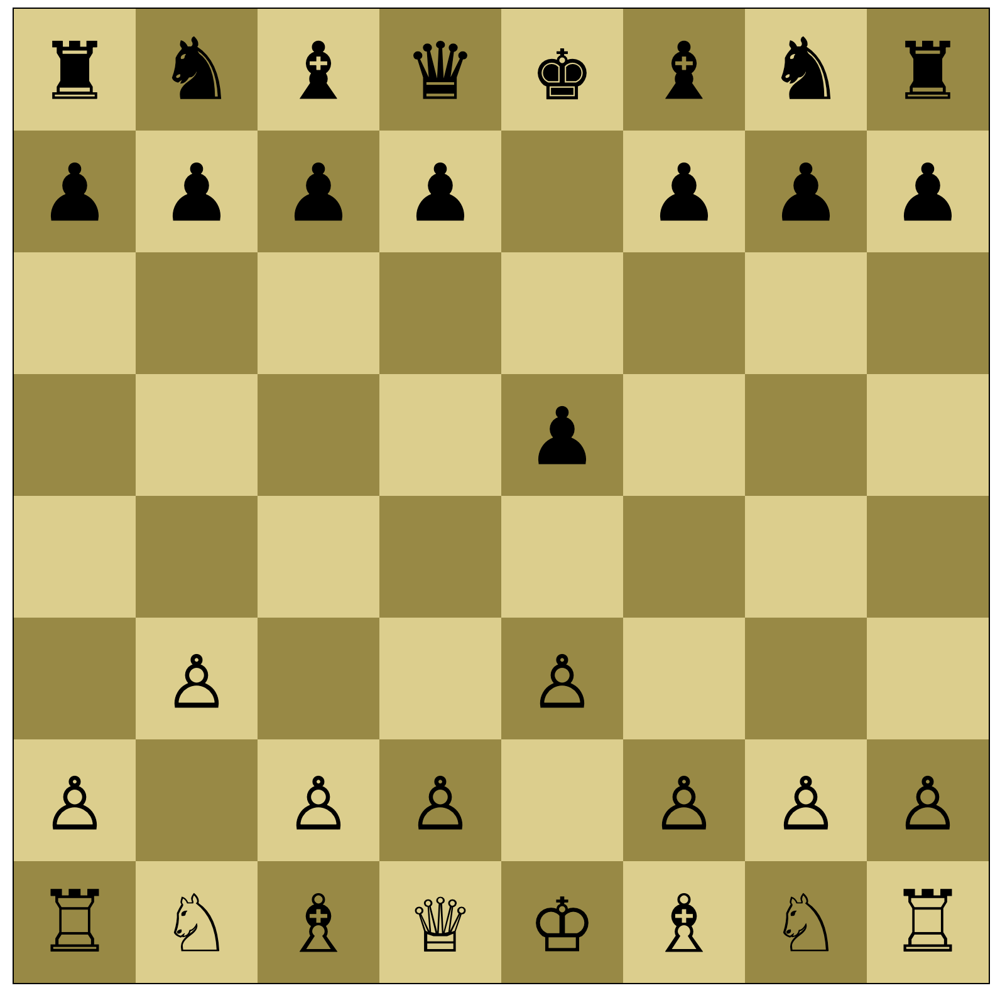

# Responsive Chessboard (Flexbox)

  ## Instructions
  1. Create a chessboard using Grid
  2. All 64 squares should always be visible (Zoomed in or out, no scrolling regardless of monitor size)
  3. All 64 squares should always be squares (no rectangle, equal length of all sides)
  4. Add chessboard pieces
  5. [Optional] Pieces should be able to move

  ## Sample Project:
  